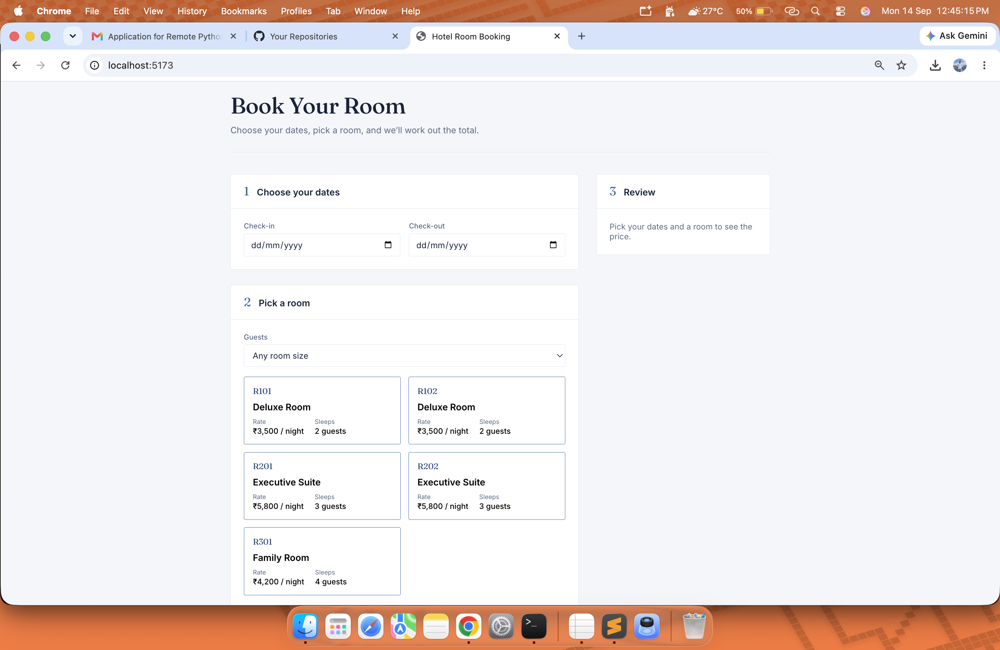

# Hotel Room Booking

 ## Tech Used

 - **React 18** with **Vite** for the frontend
- **Plain CSS** for styling
- **Vitest** for unit testing

 There is no backend, routing, or state management library because this project only needs a single page.

 ## Getting Started

 First, install the dependencies:

```
npm install
```

 Then start the development server:

```
npm run dev
```

 This will give you a local URL where you can open the app.


 ## Project Structure

```
src/
  data/rooms.js
  utils/booking.js
  utils/booking.test.js
  components/
  App.jsx
  styles.css
```

 - `data/rooms.js` contains the sample rooms and a few existing bookings.
- `utils/booking.js` contains the booking-related logic like date checks, night calculation, price calculation, and validation.
- `utils/booking.test.js` contains the unit tests.
- `components/` contains the smaller UI parts like room cards, date fields, guest filter, and booking summary.
- `App.jsx` connects everything together.
- `styles.css` contains the page styling.

 ## How the Booking Logic Works

 I kept the main booking logic separate from the UI so it is easier to understand and test.

 Dates come from the normal HTML date input in `YYYY-MM-DD` format. They are handled at UTC midnight to avoid issues with time zones or daylight saving changes when calculating the number of nights.

 The main functions are:

 - `calculateNights` — calculates how many nights the booking is for.
- `calculateTotal` — calculates the total price.
- `validateBooking` — checks whether the selected booking is valid.

 `validateBooking` handles things like missing dates, past check-in dates, invalid date ranges, no room selected, and room availability.

 The UI only displays the result of these checks instead of having the same validation logic in multiple places.

 ## Edge Cases

 A few common booking mistakes are handled as well:

 - Check-in and check-out on the same day are not allowed.
- Check-out before check-in is not allowed.
- Check-in dates in the past are rejected.
- When nothing has been selected yet, the summary shows a simple message instead of showing errors immediately.
- If a room is already booked for the selected dates, it is disabled and marked as **"Booked for these dates"**.

 ## Bonus Features

 A few extra things are also included:

 - **Room availability check** using the existing bookings in `data/rooms.js`.
- **Unit tests** for booking calculations and validation.
- **Guest filter** so users can filter rooms based on the maximum number of guests they can accommodate.

## Screenshot




## With More Time

I would improve the UI further, add a booking confirmation flow, and expand the test coverage.
